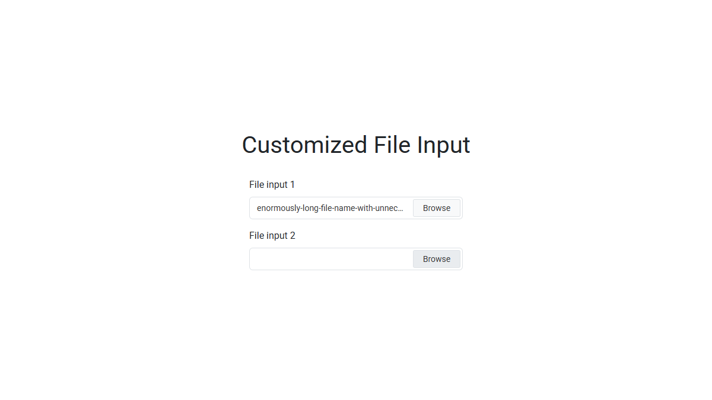

<kbd>
    
</kbd>

# Customized File Input
A small JavaScript plugin that enhances the default file input with decorative elements,
allowing to achieve any visual appearance while maintaining full functionality.

**Live Demo:**
[https://demo.arsen.pro/customized-file-input/](https://demo.arsen.pro/customized-file-input/)

## Features
* Fully customizable fake input and browse button
* Handles long file names gracefully with ellipsis
* Keyboard accessible
* Responsive layout
* Semantic markup
* Lightweight
* Translatable

## Technologies
* JavaScript (ES6+)
* HTML5
* CSS3

## How to use
1. Include `customized-file-input.css` and `customized-file-input.js` in your page.
2. Initialize the plugin with default or custom options.

## Options
| Option           | Type     | Default                               | Description                                                                |
|------------------|----------|---------------------------------------|----------------------------------------------------------------------------|
| `wrapperClass`   | `string` | `'customized-file-input'`             | CSS class of the wrapper element containing the file input and decorations |
| `fakeInputClass` | `string` | `'customized-file-input__fake-input'` | CSS class of the fake input where the selected file name is displayed      |
| `fakeBtnClass`   | `string` | `'customized-file-input__fake-btn'`   | CSS class of the fake button                                               |
| `fakeBtnText`    | `string` | `'Browse'`                            | Text displayed inside the fake button                                      |