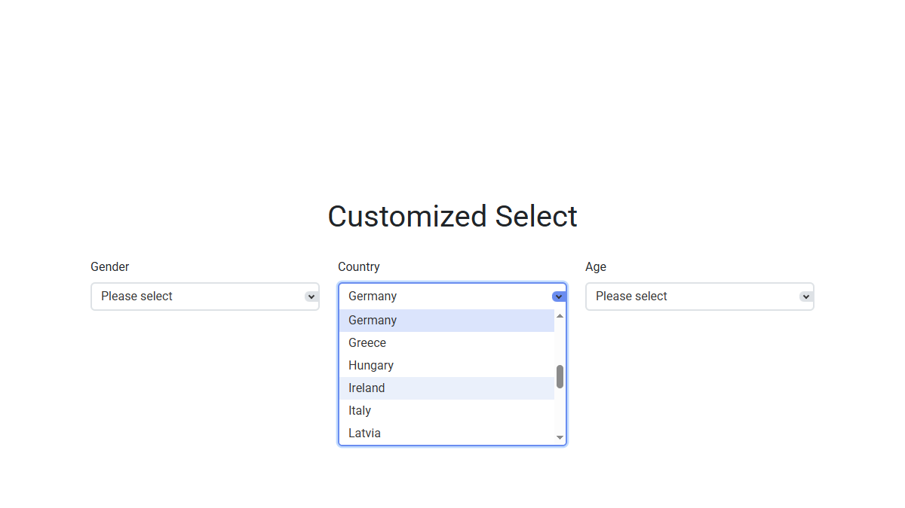

<kbd>
    
</kbd>

# Customized Select
A plain JavaScript plugin that creates a custom dropdown UI while keeping the native `<select>`
fully functional and supporting both mouse and keyboard interactions.

**Live Demo:**
[https://demo.arsen.pro/js/customized-select/](https://demo.arsen.pro/js/customized-select/)

## Features
* Native `<select>` remains functional
* UI synchronized with native `<select>`
* Width: any CSS unit or auto-calculated
* Options list scrolls when exceeding the limit
* Automatic z-index to appear above page content
* Keyboard accessible (Tab, Enter, Space, Arrow keys, Esc)
* Customizable
* Smooth transitions
* Responsive layout
* Semantic markup
* Dependency-free
* Lightweight

## Technologies
* JavaScript (ES6+)
* HTML5
* CSS3

## How to use
1. Include `customized-select.css` and `customized-select.js` in your page.
2. Initialize the plugin with default or custom options.

## Options
| Option                  | Type                   | Default                                    | Description                                                                             |
|-------------------------|------------------------|--------------------------------------------|-----------------------------------------------------------------------------------------|
| `width`                 | `string\|number\|null` | `null`                                     | Custom width of the ui-select; accepts any valid CSS width; if null, auto-calculated    |
| `visibleOptions`        | `number`               | `0`                                        | Maximum number of visible options before scrolling appears; if 0, all options are shown |
| `baseZIndex`            | `number`               | `100`                                      | Base z-index applied to each ui-select to appear above page content                     |
| `wrapperClass `         | `string`               | `'customized-select'`                      | CSS class for the wrapper element                                                       |
| `wrapperSelectedClass`  | `string`               | `'customized-select--selected'`            | CSS class for the wrapper element applied when the ui-select is open                    |
| `uiSelectClass`         | `string`               | `'customized-select__ui'`                  | CSS class for the ui-select element                                                     |
| `uiSelectValueClass`    | `string`               | `'customized-select__ui-value'`            | CSS class for the element showing the selected value                                    |
| `uiSelectArrowClass`    | `string`               | `'customized-select__ui-arrow'`            | CSS class for the dropdown arrow                                                        |
| `uiOptionsListClass`    | `string`               | `'customized-select__ui-options'`          | CSS class for the options list container                                                |
| `uiOptionClass`         | `string`               | `'customized-select__ui-option'`           | CSS class for each option in the list                                                   |
| `uiSelectedOptionClass` | `string`               | `'customized-select__ui-option--selected'` | CSS class for the currently selected option                                             |