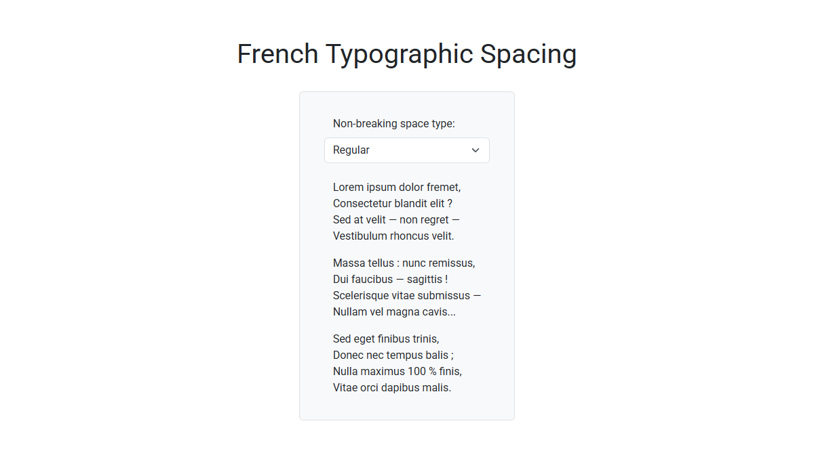

<kbd>
    
</kbd>

# French Typographic Spacing
A plain JavaScript plugin that adds non-breaking spaces before punctuation marks,
following French typographic rules.

**Live Demo:**
[https://demo.arsen.pro/js/french-typographic-spacing/](https://demo.arsen.pro/js/french-typographic-spacing/)

## Features
* Customizable
* Dependency-free
* Lightweight

## Technologies
* JavaScript (ES6+)

## How to use
1. Include `french-typographic-spacing.js` in your page.
2. Initialize the plugin with default or custom options.

## Options
<table>
  <thead>
    <tr>
      <th>Option</th>
      <th>Type</th>
      <th>Default</th>
      <th>Description</th>
    </tr>
  </thead>
  <tbody>
    <tr>
      <td>
        <code>nbspType</code>
      </td>
      <td>
        <code>'none'</code> 
        <code>'narrow'</code> 
        <code>'regular'</code>
      </td>
      <td>
        <code>'regular'</code>
      </td>
      <td>
        Type of non-breaking space to insert: 
        - <code>'none'</code>: Do not insert any non-breaking spaces and remove existing ones 
        - <code>'narrow'</code>: Insert narrow non-breaking spaces 
        - <code>'regular'</code>: Insert regular non-breaking spaces
      </td>
    </tr>
    <tr>
      <td>
        <code>insertBeforeChars</code>
      </td>
      <td>
        <code>string</code>
      </td>
      <td>
        <code>'?!:;%'</code>
      </td>
      <td>
        Characters before which a non-breaking space should be inserted
      </td>
    </tr>
    <tr>
      <td>
        <code>skipTags</code>
      </td>
      <td>
        <code>string[]</code>
      </td>
      <td>
        <code>'STYLE'</code> 
        <code>'SCRIPT'</code> 
        <code>'NOSCRIPT'</code> 
        <code>'IFRAME'</code> 
        <code>'INPUT'</code> 
        <code>'TEXTAREA'</code>
      </td>
      <td>
        HTML tags to skip when processing
      </td>
    </tr>
  </tbody>
</table>