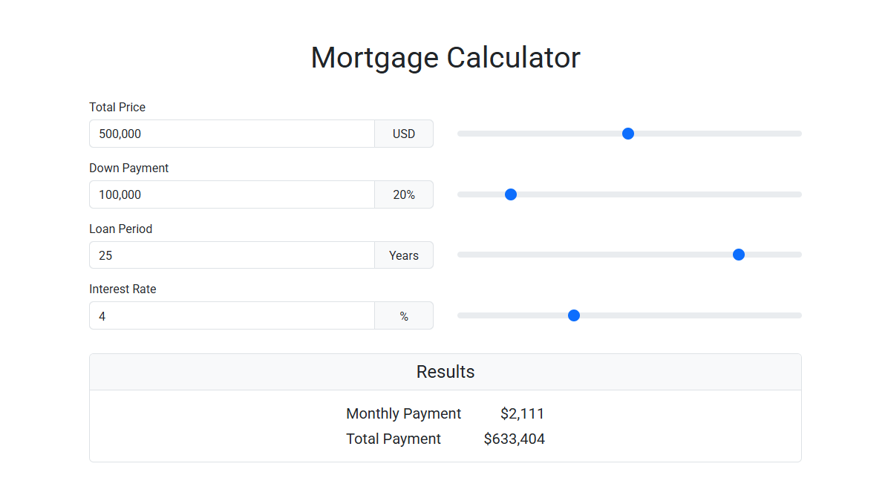

<kbd>
    
</kbd>

# Mortgage Calculator
A plain JavaScript plugin that calculates monthly and total mortgage payments.
Each input field is paired with a slider for fast and intuitive data entry.

**Live Demo:**
[https://demo.arsen.pro/js/mortgage-calculator/](https://demo.arsen.pro/js/mortgage-calculator/)

## Features
* Slider controls for inputs
* Customizable
* Keyboard accessible
* Responsive layout
* Semantic markup
* Dependency-free
* Lightweight
* Translatable

## Technologies
* JavaScript (ES6+)
* HTML5
* CSS3
* Bootstrap 5

## How to use
1. Add the calculator form to your page: `
…
`.
2. Include `mortgage-calculator.css` and `mortgage-calculator.js` in your page.
3. Initialize the plugin with default or custom options.

## Options
| Option            | Type     | Default   | Description                      |
|-------------------|----------|-----------|----------------------------------|
| `price`           | `number` | `1000000` | Initial property price (USD)     |
| `downPayment`     | `number` | `20`      | Initial down payment (%)         |
| `loanPeriod`      | `number` | `25`      | Initial loan period (years)      |
| `interestRate`    | `number` | `4`       | Initial interest rate (%)        |
| `minPrice`        | `number` | `10000`   | Minimum allowed price (USD)      |
| `maxPrice`        | `number` | `2000000` | Maximum allowed price (USD)      |
| `minDownPayment`  | `number` | `10`      | Minimum allowed down payment (%) |
| `maxDownPayment`  | `number` | `80`      | Maximum allowed down payment (%) |
| `minLoanPeriod`   | `number` | `1`       | Minimum loan period (years)      |
| `maxLoanPeriod`   | `number` | `30`      | Maximum loan period (years)      |
| `minInterestRate` | `number` | `1`       | Minimum interest rate (%)        |
| `maxInterestRate` | `number` | `10`      | Maximum interest rate (%)        |