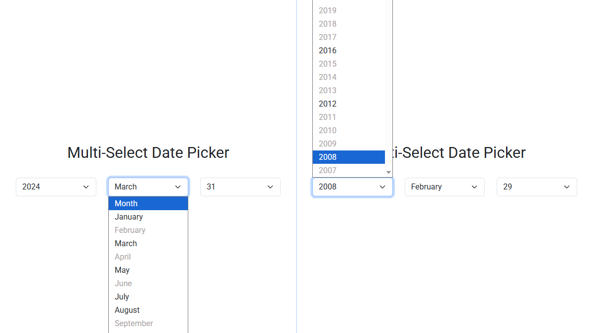

<kbd>
    
</kbd>

# Multi-Select Date Picker
A JavaScript solution for selecting a date using three synchronized `select` boxes
(year, month, day). Prevents selecting invalid dates.

**Live Demo:**
[https://demo.arsen.pro/multi-select-date-picker/](https://demo.arsen.pro/multi-select-date-picker/)

## Features
* Keyboard accessible
* Lightweight
* Customizable

## Technologies
* JavaScript (ES6+)
* HTML5

## How to use
1. Add three `select` boxes to your form.
2. Include `multi-select-date-picker.js` in your page.
3. Initialize the plugin with default or custom options.

## Options
| Option          | Type     | Default         | Description                       |
|-----------------|----------|-----------------|-----------------------------------|
| `yearSelector`  | `string` | `'#date-year'`  | CSS selector for the year select  |
| `monthSelector` | `string` | `'#date-month'` | CSS selector for the month select |
| `daySelector`   | `string` | `'#date-day'`   | CSS selector for the day select   |