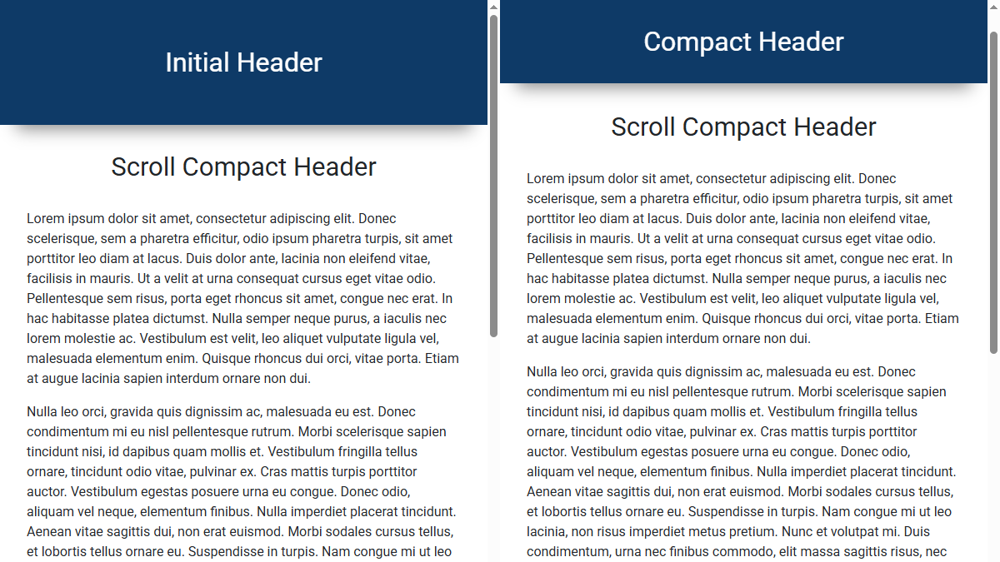

<kbd>
    
</kbd>

# Scroll Compact Header
A minimal JavaScript plugin that shrinks the header height when the page is scrolled down,
and restores it when scrolled back to the top.

**Live Demo:**
[https://demo.arsen.pro/scroll-compact-header/](https://demo.arsen.pro/scroll-compact-header/)

## Features
* Smooth height transitions
* Responsive layout
* Lightweight

## Technologies
* JavaScript (ES6+)
* HTML5
* CSS3

## How to use
1. Include `scroll-compact-header.css` and `scroll-compact-header.js` in your page.
2. Initialize the plugin, optionally customizing the header's `id`, and the CSS class toggled on scroll.