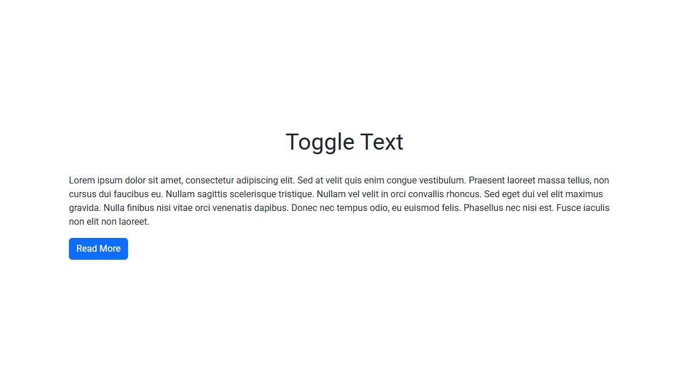

<kbd>
    
</kbd>


# Toggle Text
A JavaScript plugin creating collapsible text sections,
offering configurable break points and smooth height transitions.


**Live Demo:**
[https://work.arsen.pro/toggle-text/](https://work.arsen.pro/toggle-text/)


## Features
* Smooth height transitions
* Keyboard accessible
* Responsive layout
* Semantic markup
* Lightweight
* Customizable
* Translatable


## Technologies
* JavaScript (ES6+)
* HTML5
* CSS3
* Bootstrap 5


## How to use
1. Prepare your HTML markup as in the example below.
2. Include `toggle-text.css` and `toggle-text.js`.
3. Initialize the plugin with your options.

**Example:**
```html
<div class="toggle-text">
  <div class="toggle-text__content">
    <!-- Your text here -->
  </div>
  <button type="button" class="btn btn-primary toggle-text__btn">Read More</button>
</div>
```


## Options
| Option               | Type     | Default                      | Description                                                              |
|----------------------|----------|------------------------------|--------------------------------------------------------------------------|
| `breakPointSelector` | `string` | `'p:nth-child(2)'`           | CSS selector for the element before which a break point will be inserted |
| `contentClass`       | `string` | `'toggle-text__content'`     | CSS class for the content container                                      |
| `breakPointClass`    | `string` | `'toggle-text__break-point'` | CSS class for the inserted break point element                           |
| `btnClass`           | `string` | `'toggle-text__btn'`         | CSS class for the toggle button                                          |
| `btnTextExpand`      | `string` | `'Read More'`                | Button text when content is collapsed                                    |
| `btnTextCollapse`    | `string` | `'Read Less'`                | Button text when content is expanded                                     |
| `transitionDuration` | `number` | `400`                        | Duration of the height transition in milliseconds                        |